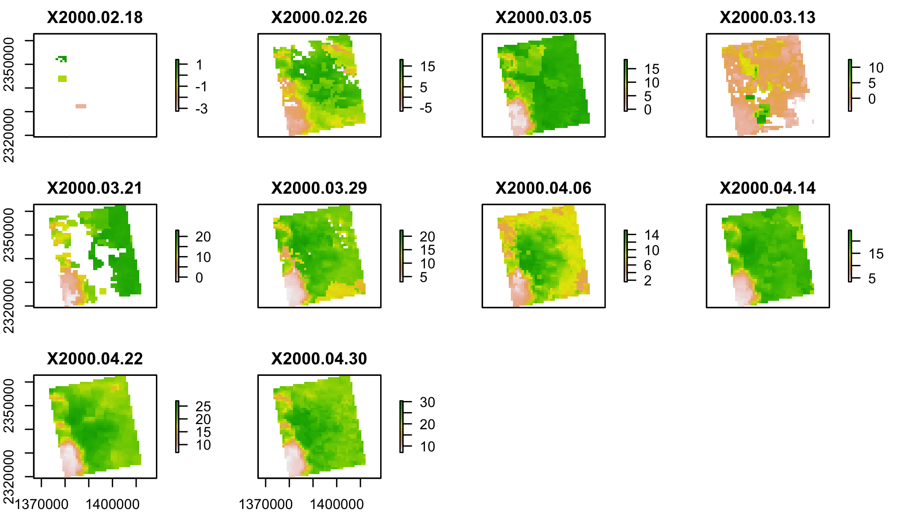
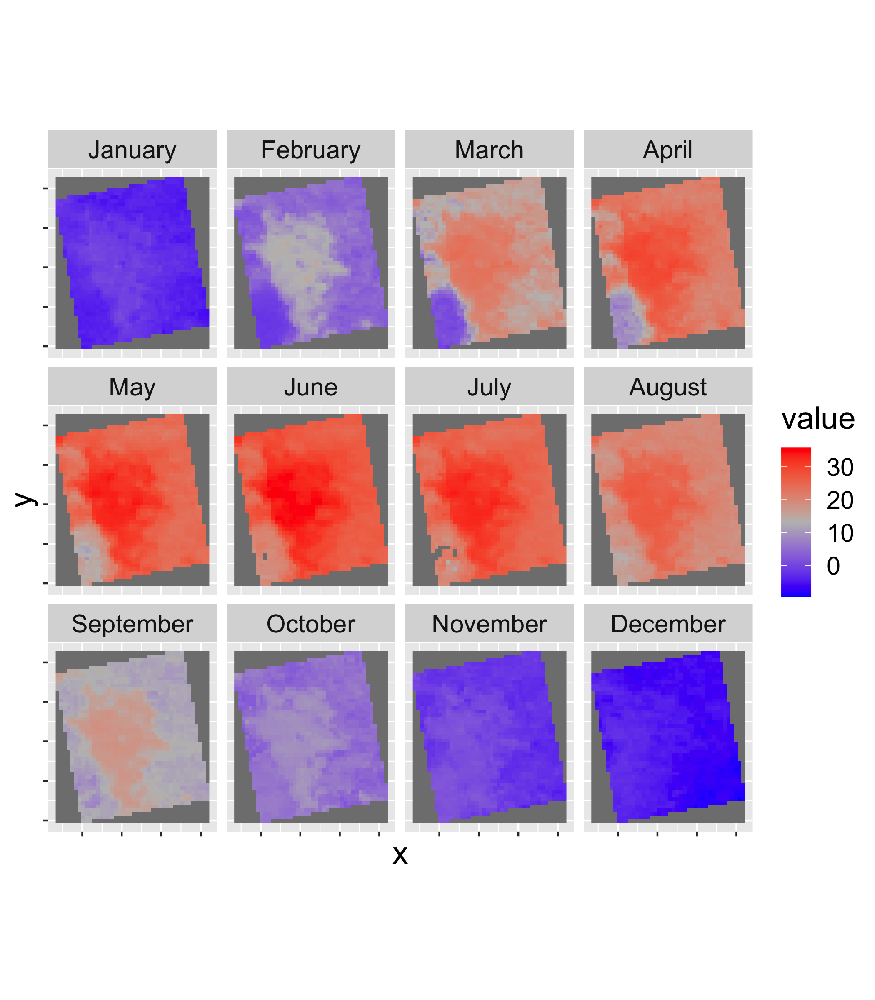

# Tasks

- Extract a timeseries from a single location in a netcdf file (part 1)
- Calculate a monthly climatology from a weekely timeseries (part 2)
- Summarize Land Surface Temperature by Land Cover (part 3)


[<i class="fa fa-file-code-o fa-3x" aria-hidden="true"></i> The R Script associated with this page is available here](scripts/CS_10.R).  If you like, you can download this file and open it (or copy-paste into a new script) with RStudio so you can follow along.  


### Libraries


```r
library(raster)
library(rasterVis)
library(rgdal)
library(ggmap)
library(tidyverse)
library(knitr)

# New Packages
library(ncdf4) # to import data from netcdf format
```

# Case Study Set up

## Identify (and create) download folders

Today we'll work with:

* Land Surface Temperature (`lst`): MOD11A2
* Land Cover (`lc`): MCD12Q1

## Land Use Land Cover


```r
# Create afolder to hold the downloaded data
dir.create("data",showWarnings = F) #create a folder to hold the data

lulc_url="https://github.com/adammwilson/DataScienceData/blob/master/inst/extdata/appeears/MCD12Q1.051_aid0001.nc?raw=true"
lst_url="https://github.com/adammwilson/DataScienceData/blob/master/inst/extdata/appeears/MOD11A2.006_aid0001.nc?raw=true"

# download them
download.file(lulc_url,destfile="data/MCD12Q1.051_aid0001.nc")
download.file(lst_url,destfile="data/MOD11A2.006_aid0001.nc")
```

You should also edit your .gitignore file (in your tasks repository folder) to include `*data*` on one line. This will prevent git from adding these files.  


## Load data into R

```r
lulc=stack("data/MCD12Q1.051_aid0001.nc",varname="Land_Cover_Type_1")
lst=stack("data/MOD11A2.006_aid0001.nc",varname="LST_Day_1km")
```

You will probably see some errors about 

```
>>>> WARNING <<<  attribute longitude_of_projection_origin is an 8-byte value, but R"
[1] "does not support this data type. I am returning a double precision"
[1] "floating point, but you must be aware that this could lose precision!"
```

You can safely ignore this.  


## Explore LULC data

```r
plot(lulc)
```

<!-- -->
 

We'll just pick one year to work with to keep this simple:

```r
lulc=lulc[[13]]
plot(lulc)
```

<!-- -->

### Process landcover data

Assign land cover clases from [MODIS website](https://lpdaac.usgs.gov/dataset_discovery/modis/modis_products_table/mcd12q1)


```r
  Land_Cover_Type_1 = c(
    Water = 0, 
    `Evergreen Needleleaf forest` = 1, 
    `Evergreen Broadleaf forest` = 2,
    `Deciduous Needleleaf forest` = 3, 
    `Deciduous Broadleaf forest` = 4,
    `Mixed forest` = 5, 
    `Closed shrublands` = 6,
    `Open shrublands` = 7,
    `Woody savannas` = 8, 
    Savannas = 9,
    Grasslands = 10,
    `Permanent wetlands` = 11, 
    Croplands = 12,
    `Urban & built-up` = 13,
    `Cropland/Natural vegetation mosaic` = 14, 
    `Snow & ice` = 15,
    `Barren/Sparsely vegetated` = 16, 
    Unclassified = 254,
    NoDataFill = 255)

lcd=data.frame(
  ID=Land_Cover_Type_1,
  landcover=names(Land_Cover_Type_1),
  col=c("#000080","#008000","#00FF00", "#99CC00","#99FF99", "#339966", "#993366", "#FFCC99", "#CCFFCC", "#FFCC00", "#FF9900", "#006699", "#FFFF00", "#FF0000", "#999966", "#FFFFFF", "#808080", "#000000", "#000000"),
  stringsAsFactors = F)
# colors from https://lpdaac.usgs.gov/about/news_archive/modisterra_land_cover_types_yearly_l3_global_005deg_cmg_mod12c1
kable(head(lcd))
```

<table>
 <thead>
  <tr>
   <th style="text-align:left;">   </th>
   <th style="text-align:right;"> ID </th>
   <th style="text-align:left;"> landcover </th>
   <th style="text-align:left;"> col </th>
  </tr>
 </thead>
<tbody>
  <tr>
   <td style="text-align:left;"> Water </td>
   <td style="text-align:right;"> 0 </td>
   <td style="text-align:left;"> Water </td>
   <td style="text-align:left;"> #000080 </td>
  </tr>
  <tr>
   <td style="text-align:left;"> Evergreen Needleleaf forest </td>
   <td style="text-align:right;"> 1 </td>
   <td style="text-align:left;"> Evergreen Needleleaf forest </td>
   <td style="text-align:left;"> #008000 </td>
  </tr>
  <tr>
   <td style="text-align:left;"> Evergreen Broadleaf forest </td>
   <td style="text-align:right;"> 2 </td>
   <td style="text-align:left;"> Evergreen Broadleaf forest </td>
   <td style="text-align:left;"> #00FF00 </td>
  </tr>
  <tr>
   <td style="text-align:left;"> Deciduous Needleleaf forest </td>
   <td style="text-align:right;"> 3 </td>
   <td style="text-align:left;"> Deciduous Needleleaf forest </td>
   <td style="text-align:left;"> #99CC00 </td>
  </tr>
  <tr>
   <td style="text-align:left;"> Deciduous Broadleaf forest </td>
   <td style="text-align:right;"> 4 </td>
   <td style="text-align:left;"> Deciduous Broadleaf forest </td>
   <td style="text-align:left;"> #99FF99 </td>
  </tr>
  <tr>
   <td style="text-align:left;"> Mixed forest </td>
   <td style="text-align:right;"> 5 </td>
   <td style="text-align:left;"> Mixed forest </td>
   <td style="text-align:left;"> #339966 </td>
  </tr>
</tbody>
</table>

Convert LULC raster into a 'factor' (categorical) raster.  This requires building the Raster Attribute Table (RAT).  Unfortunately, this is a bit of manual process as follows.

```r
# convert to raster (easy)
lulc=as.factor(lulc)

# update the RAT with a left join
levels(lulc)=left_join(levels(lulc)[[1]],lcd)
```

```
## Joining, by = "ID"
```


```r
# plot it
gplot(lulc)+
  geom_raster(aes(fill=as.factor(value)))+
  scale_fill_manual(values=levels(lulc)[[1]]$col,
                    labels=levels(lulc)[[1]]$landcover,
                    name="Landcover Type")+
  coord_equal()+
  theme(legend.position = "bottom")+
  guides(fill=guide_legend(ncol=1,byrow=TRUE))
```

<!-- -->

# Land Surface Temperature

```r
plot(lst[[1:12]])
```

<!-- -->

## Convert LST to Degrees C 
You can convert LST from Degrees Kelvin (K) to Celcius (C) with `offs()`.


```r
offs(lst)=-273.15
plot(lst[[1:10]])
```

<!-- -->


<div class="well">

# MODLAND Quality control

See a detailed explaination [here](https://lpdaac.usgs.gov/sites/default/files/public/modis/docs/MODIS_LP_QA_Tutorial-1b.pdf).  Some code below from [Steven Mosher's blog](https://stevemosher.wordpress.com/2012/12/05/modis-qc-bits/).

Expand this to learn more about MODIS quality control.  This is optional for this class, but important if you want to work with this kind of data 'for real'.

<button data-toggle="collapse" class="btn btn-primary btn-sm round" data-target="#demo1">More Info</button>
<div id="demo1" class="collapse">
## MOD11A2 (Land Surface Temperature) Quality Control

[MOD11A2 QC Layer table](https://lpdaac.usgs.gov/dataset_discovery/modis/modis_products_table/mod11a2)


```r
lstqc=stack("data/MOD11A2.006_aid0001.nc",varname="QC_Day")
plot(lstqc[[1:2]])
```

<!-- -->

### LST QC data

QC data are encoded in 8-bit 'words' to compress information.


```r
values(lstqc[[1:2]])%>%table()
```

```
## .
##    2   17   33   65   81   97  145 
## 1569    8    5  675  335    4   90
```


```r
intToBits(65)
```

```
##  [1] 01 00 00 00 00 00 01 00 00 00 00 00 00 00 00 00 00 00 00 00 00 00 00
## [24] 00 00 00 00 00 00 00 00 00
```

```r
intToBits(65)[1:8]
```

```
## [1] 01 00 00 00 00 00 01 00
```

```r
as.integer(intToBits(65)[1:8])
```

```
## [1] 1 0 0 0 0 0 1 0
```
#### MODIS QC data are _Big Endian_

Format          Digits              value     sum
----            ----                ----      ----
Little Endian   1 0 0 0 0 0 1 0     65        2^0 + 2^6
Big Endian      0 1 0 0 0 0 0 1     65        2^6 + 2^0


Reverse the digits with `rev()` and compare with QC table above.


```r
rev(as.integer(intToBits(65)[1:8]))
```

```
## [1] 0 1 0 0 0 0 0 1
```
QC for value `65`:

* LST produced, other quality, recommend examination of more detailed QA
* good data quality of L1B in 7 TIR bands
* average emissivity error <= 0.01
* Average LST error <= 2K

### Filter the the lst data using the QC data


```r
## set up data frame to hold all combinations
QC_Data <- data.frame(Integer_Value = 0:255,
Bit7 = NA, Bit6 = NA, Bit5 = NA, Bit4 = NA,
Bit3 = NA, Bit2 = NA, Bit1 = NA, Bit0 = NA,
QA_word1 = NA, QA_word2 = NA, QA_word3 = NA,
QA_word4 = NA)

## 
for(i in QC_Data$Integer_Value){
AsInt <- as.integer(intToBits(i)[1:8])
QC_Data[i+1,2:9]<- AsInt[8:1]
}

QC_Data$QA_word1[QC_Data$Bit1 == 0 & QC_Data$Bit0==0] <- "LST GOOD"
QC_Data$QA_word1[QC_Data$Bit1 == 0 & QC_Data$Bit0==1] <- "LST Produced,Other Quality"
QC_Data$QA_word1[QC_Data$Bit1 == 1 & QC_Data$Bit0==0] <- "No Pixel,clouds"
QC_Data$QA_word1[QC_Data$Bit1 == 1 & QC_Data$Bit0==1] <- "No Pixel, Other QA"

QC_Data$QA_word2[QC_Data$Bit3 == 0 & QC_Data$Bit2==0] <- "Good Data"
QC_Data$QA_word2[QC_Data$Bit3 == 0 & QC_Data$Bit2==1] <- "Other Quality"
QC_Data$QA_word2[QC_Data$Bit3 == 1 & QC_Data$Bit2==0] <- "TBD"
QC_Data$QA_word2[QC_Data$Bit3 == 1 & QC_Data$Bit2==1] <- "TBD"

QC_Data$QA_word3[QC_Data$Bit5 == 0 & QC_Data$Bit4==0] <- "Emiss Error <= .01"
QC_Data$QA_word3[QC_Data$Bit5 == 0 & QC_Data$Bit4==1] <- "Emiss Err >.01 <=.02"
QC_Data$QA_word3[QC_Data$Bit5 == 1 & QC_Data$Bit4==0] <- "Emiss Err >.02 <=.04"
QC_Data$QA_word3[QC_Data$Bit5 == 1 & QC_Data$Bit4==1] <- "Emiss Err > .04"

QC_Data$QA_word4[QC_Data$Bit7 == 0 & QC_Data$Bit6==0] <- "LST Err <= 1"
QC_Data$QA_word4[QC_Data$Bit7 == 0 & QC_Data$Bit6==1] <- "LST Err > 2 LST Err <= 3"
QC_Data$QA_word4[QC_Data$Bit7 == 1 & QC_Data$Bit6==0] <- "LST Err > 1 LST Err <= 2"
QC_Data$QA_word4[QC_Data$Bit7 == 1 & QC_Data$Bit6==1] <- "LST Err > 4"
kable(head(QC_Data))
```

<table>
 <thead>
  <tr>
   <th style="text-align:right;"> Integer_Value </th>
   <th style="text-align:right;"> Bit7 </th>
   <th style="text-align:right;"> Bit6 </th>
   <th style="text-align:right;"> Bit5 </th>
   <th style="text-align:right;"> Bit4 </th>
   <th style="text-align:right;"> Bit3 </th>
   <th style="text-align:right;"> Bit2 </th>
   <th style="text-align:right;"> Bit1 </th>
   <th style="text-align:right;"> Bit0 </th>
   <th style="text-align:left;"> QA_word1 </th>
   <th style="text-align:left;"> QA_word2 </th>
   <th style="text-align:left;"> QA_word3 </th>
   <th style="text-align:left;"> QA_word4 </th>
  </tr>
 </thead>
<tbody>
  <tr>
   <td style="text-align:right;"> 0 </td>
   <td style="text-align:right;"> 0 </td>
   <td style="text-align:right;"> 0 </td>
   <td style="text-align:right;"> 0 </td>
   <td style="text-align:right;"> 0 </td>
   <td style="text-align:right;"> 0 </td>
   <td style="text-align:right;"> 0 </td>
   <td style="text-align:right;"> 0 </td>
   <td style="text-align:right;"> 0 </td>
   <td style="text-align:left;"> LST GOOD </td>
   <td style="text-align:left;"> Good Data </td>
   <td style="text-align:left;"> Emiss Error &lt;= .01 </td>
   <td style="text-align:left;"> LST Err &lt;= 1 </td>
  </tr>
  <tr>
   <td style="text-align:right;"> 1 </td>
   <td style="text-align:right;"> 0 </td>
   <td style="text-align:right;"> 0 </td>
   <td style="text-align:right;"> 0 </td>
   <td style="text-align:right;"> 0 </td>
   <td style="text-align:right;"> 0 </td>
   <td style="text-align:right;"> 0 </td>
   <td style="text-align:right;"> 0 </td>
   <td style="text-align:right;"> 1 </td>
   <td style="text-align:left;"> LST Produced,Other Quality </td>
   <td style="text-align:left;"> Good Data </td>
   <td style="text-align:left;"> Emiss Error &lt;= .01 </td>
   <td style="text-align:left;"> LST Err &lt;= 1 </td>
  </tr>
  <tr>
   <td style="text-align:right;"> 2 </td>
   <td style="text-align:right;"> 0 </td>
   <td style="text-align:right;"> 0 </td>
   <td style="text-align:right;"> 0 </td>
   <td style="text-align:right;"> 0 </td>
   <td style="text-align:right;"> 0 </td>
   <td style="text-align:right;"> 0 </td>
   <td style="text-align:right;"> 1 </td>
   <td style="text-align:right;"> 0 </td>
   <td style="text-align:left;"> No Pixel,clouds </td>
   <td style="text-align:left;"> Good Data </td>
   <td style="text-align:left;"> Emiss Error &lt;= .01 </td>
   <td style="text-align:left;"> LST Err &lt;= 1 </td>
  </tr>
  <tr>
   <td style="text-align:right;"> 3 </td>
   <td style="text-align:right;"> 0 </td>
   <td style="text-align:right;"> 0 </td>
   <td style="text-align:right;"> 0 </td>
   <td style="text-align:right;"> 0 </td>
   <td style="text-align:right;"> 0 </td>
   <td style="text-align:right;"> 0 </td>
   <td style="text-align:right;"> 1 </td>
   <td style="text-align:right;"> 1 </td>
   <td style="text-align:left;"> No Pixel, Other QA </td>
   <td style="text-align:left;"> Good Data </td>
   <td style="text-align:left;"> Emiss Error &lt;= .01 </td>
   <td style="text-align:left;"> LST Err &lt;= 1 </td>
  </tr>
  <tr>
   <td style="text-align:right;"> 4 </td>
   <td style="text-align:right;"> 0 </td>
   <td style="text-align:right;"> 0 </td>
   <td style="text-align:right;"> 0 </td>
   <td style="text-align:right;"> 0 </td>
   <td style="text-align:right;"> 0 </td>
   <td style="text-align:right;"> 1 </td>
   <td style="text-align:right;"> 0 </td>
   <td style="text-align:right;"> 0 </td>
   <td style="text-align:left;"> LST GOOD </td>
   <td style="text-align:left;"> Other Quality </td>
   <td style="text-align:left;"> Emiss Error &lt;= .01 </td>
   <td style="text-align:left;"> LST Err &lt;= 1 </td>
  </tr>
  <tr>
   <td style="text-align:right;"> 5 </td>
   <td style="text-align:right;"> 0 </td>
   <td style="text-align:right;"> 0 </td>
   <td style="text-align:right;"> 0 </td>
   <td style="text-align:right;"> 0 </td>
   <td style="text-align:right;"> 0 </td>
   <td style="text-align:right;"> 1 </td>
   <td style="text-align:right;"> 0 </td>
   <td style="text-align:right;"> 1 </td>
   <td style="text-align:left;"> LST Produced,Other Quality </td>
   <td style="text-align:left;"> Other Quality </td>
   <td style="text-align:left;"> Emiss Error &lt;= .01 </td>
   <td style="text-align:left;"> LST Err &lt;= 1 </td>
  </tr>
</tbody>
</table>

### Select which QC Levels to keep

```r
keep=QC_Data[QC_Data$Bit1 == 0,]
keepvals=unique(keep$Integer_Value)
keepvals
```

```
##   [1]   0   1   4   5   8   9  12  13  16  17  20  21  24  25  28  29  32
##  [18]  33  36  37  40  41  44  45  48  49  52  53  56  57  60  61  64  65
##  [35]  68  69  72  73  76  77  80  81  84  85  88  89  92  93  96  97 100
##  [52] 101 104 105 108 109 112 113 116 117 120 121 124 125 128 129 132 133
##  [69] 136 137 140 141 144 145 148 149 152 153 156 157 160 161 164 165 168
##  [86] 169 172 173 176 177 180 181 184 185 188 189 192 193 196 197 200 201
## [103] 204 205 208 209 212 213 216 217 220 221 224 225 228 229 232 233 236
## [120] 237 240 241 244 245 248 249 252 253
```

### How many observations will be dropped?


```r
qcvals=table(values(lstqc))  # this takes a minute or two


QC_Data%>%
  dplyr::select(everything(),-contains("Bit"))%>%
  mutate(Var1=as.character(Integer_Value),
         keep=Integer_Value%in%keepvals)%>%
  inner_join(data.frame(qcvals))%>%
  kable()
```

```
## Joining, by = "Var1"
```

<table>
 <thead>
  <tr>
   <th style="text-align:right;"> Integer_Value </th>
   <th style="text-align:left;"> QA_word1 </th>
   <th style="text-align:left;"> QA_word2 </th>
   <th style="text-align:left;"> QA_word3 </th>
   <th style="text-align:left;"> QA_word4 </th>
   <th style="text-align:left;"> Var1 </th>
   <th style="text-align:left;"> keep </th>
   <th style="text-align:right;"> Freq </th>
  </tr>
 </thead>
<tbody>
  <tr>
   <td style="text-align:right;"> 2 </td>
   <td style="text-align:left;"> No Pixel,clouds </td>
   <td style="text-align:left;"> Good Data </td>
   <td style="text-align:left;"> Emiss Error &lt;= .01 </td>
   <td style="text-align:left;"> LST Err &lt;= 1 </td>
   <td style="text-align:left;"> 2 </td>
   <td style="text-align:left;"> FALSE </td>
   <td style="text-align:right;"> 150019 </td>
  </tr>
  <tr>
   <td style="text-align:right;"> 17 </td>
   <td style="text-align:left;"> LST Produced,Other Quality </td>
   <td style="text-align:left;"> Good Data </td>
   <td style="text-align:left;"> Emiss Err &gt;.01 &lt;=.02 </td>
   <td style="text-align:left;"> LST Err &lt;= 1 </td>
   <td style="text-align:left;"> 17 </td>
   <td style="text-align:left;"> TRUE </td>
   <td style="text-align:right;"> 44552 </td>
  </tr>
  <tr>
   <td style="text-align:right;"> 33 </td>
   <td style="text-align:left;"> LST Produced,Other Quality </td>
   <td style="text-align:left;"> Good Data </td>
   <td style="text-align:left;"> Emiss Err &gt;.02 &lt;=.04 </td>
   <td style="text-align:left;"> LST Err &lt;= 1 </td>
   <td style="text-align:left;"> 33 </td>
   <td style="text-align:left;"> TRUE </td>
   <td style="text-align:right;"> 20225 </td>
  </tr>
  <tr>
   <td style="text-align:right;"> 49 </td>
   <td style="text-align:left;"> LST Produced,Other Quality </td>
   <td style="text-align:left;"> Good Data </td>
   <td style="text-align:left;"> Emiss Err &gt; .04 </td>
   <td style="text-align:left;"> LST Err &lt;= 1 </td>
   <td style="text-align:left;"> 49 </td>
   <td style="text-align:left;"> TRUE </td>
   <td style="text-align:right;"> 3 </td>
  </tr>
  <tr>
   <td style="text-align:right;"> 65 </td>
   <td style="text-align:left;"> LST Produced,Other Quality </td>
   <td style="text-align:left;"> Good Data </td>
   <td style="text-align:left;"> Emiss Error &lt;= .01 </td>
   <td style="text-align:left;"> LST Err &gt; 2 LST Err &lt;= 3 </td>
   <td style="text-align:left;"> 65 </td>
   <td style="text-align:left;"> TRUE </td>
   <td style="text-align:right;"> 243391 </td>
  </tr>
  <tr>
   <td style="text-align:right;"> 81 </td>
   <td style="text-align:left;"> LST Produced,Other Quality </td>
   <td style="text-align:left;"> Good Data </td>
   <td style="text-align:left;"> Emiss Err &gt;.01 &lt;=.02 </td>
   <td style="text-align:left;"> LST Err &gt; 2 LST Err &lt;= 3 </td>
   <td style="text-align:left;"> 81 </td>
   <td style="text-align:left;"> TRUE </td>
   <td style="text-align:right;"> 203501 </td>
  </tr>
  <tr>
   <td style="text-align:right;"> 97 </td>
   <td style="text-align:left;"> LST Produced,Other Quality </td>
   <td style="text-align:left;"> Good Data </td>
   <td style="text-align:left;"> Emiss Err &gt;.02 &lt;=.04 </td>
   <td style="text-align:left;"> LST Err &gt; 2 LST Err &lt;= 3 </td>
   <td style="text-align:left;"> 97 </td>
   <td style="text-align:left;"> TRUE </td>
   <td style="text-align:right;"> 25897 </td>
  </tr>
  <tr>
   <td style="text-align:right;"> 113 </td>
   <td style="text-align:left;"> LST Produced,Other Quality </td>
   <td style="text-align:left;"> Good Data </td>
   <td style="text-align:left;"> Emiss Err &gt; .04 </td>
   <td style="text-align:left;"> LST Err &gt; 2 LST Err &lt;= 3 </td>
   <td style="text-align:left;"> 113 </td>
   <td style="text-align:left;"> TRUE </td>
   <td style="text-align:right;"> 32 </td>
  </tr>
  <tr>
   <td style="text-align:right;"> 129 </td>
   <td style="text-align:left;"> LST Produced,Other Quality </td>
   <td style="text-align:left;"> Good Data </td>
   <td style="text-align:left;"> Emiss Error &lt;= .01 </td>
   <td style="text-align:left;"> LST Err &gt; 1 LST Err &lt;= 2 </td>
   <td style="text-align:left;"> 129 </td>
   <td style="text-align:left;"> TRUE </td>
   <td style="text-align:right;"> 57 </td>
  </tr>
  <tr>
   <td style="text-align:right;"> 145 </td>
   <td style="text-align:left;"> LST Produced,Other Quality </td>
   <td style="text-align:left;"> Good Data </td>
   <td style="text-align:left;"> Emiss Err &gt;.01 &lt;=.02 </td>
   <td style="text-align:left;"> LST Err &gt; 1 LST Err &lt;= 2 </td>
   <td style="text-align:left;"> 145 </td>
   <td style="text-align:left;"> TRUE </td>
   <td style="text-align:right;"> 29607 </td>
  </tr>
  <tr>
   <td style="text-align:right;"> 161 </td>
   <td style="text-align:left;"> LST Produced,Other Quality </td>
   <td style="text-align:left;"> Good Data </td>
   <td style="text-align:left;"> Emiss Err &gt;.02 &lt;=.04 </td>
   <td style="text-align:left;"> LST Err &gt; 1 LST Err &lt;= 2 </td>
   <td style="text-align:left;"> 161 </td>
   <td style="text-align:left;"> TRUE </td>
   <td style="text-align:right;"> 3 </td>
  </tr>
  <tr>
   <td style="text-align:right;"> 177 </td>
   <td style="text-align:left;"> LST Produced,Other Quality </td>
   <td style="text-align:left;"> Good Data </td>
   <td style="text-align:left;"> Emiss Err &gt; .04 </td>
   <td style="text-align:left;"> LST Err &gt; 1 LST Err &lt;= 2 </td>
   <td style="text-align:left;"> 177 </td>
   <td style="text-align:left;"> TRUE </td>
   <td style="text-align:right;"> 5 </td>
  </tr>
</tbody>
</table>

Do you want to update the values you are keeping?

### Filter the LST Data keeping only `keepvals`

These steps take a couple minutes.  

Make logical flag to use for mask

```r
lstkeep=calc(lstqc,function(x) x%in%keepvals)
```

Plot the mask

```r
gplot(lstkeep[[4:8]])+
  geom_raster(aes(fill=as.factor(value)))+
  facet_grid(variable~.)+
  scale_fill_manual(values=c("blue","red"),name="Keep")+
  coord_equal()+
  theme(legend.position = "bottom")
```

<!-- -->


Mask the lst data using the QC data and overwrite the original data.

```r
lst=mask(lst,mask=lstkeep,maskval=0)
```

</div>
</div>


## Add Dates to Z (time) dimension

The default layer names of the LST file include the date as follows:


```r
names(lst)[1:5]
```

```
## [1] "X2000.02.18" "X2000.02.26" "X2000.03.05" "X2000.03.13" "X2000.03.21"
```

Convert those values to a proper R Date format by dropping the "X" and using `as.Date()`.

```r
tdates=names(lst)%>%
  sub(pattern="X",replacement="")%>%
  as.Date("%Y.%m.%d")

names(lst)=1:nlayers(lst)
lst=setZ(lst,tdates)
```


## Part 1: Extract timeseries for a point

Extract LST values for a single point and plot them.

<div class="well">
<button data-toggle="collapse" class="btn btn-primary btn-sm round" data-target="#demo2">Show Hints</button>
<div id="demo2" class="collapse">

1. Use `lw=SpatialPoints(data.frame(x= -78.791547,y=43.007211))` to define a new Spatial Point at that location.
2. Set the projection of your point with `projection()` to `"+proj=longlat"`.
3. Transform the point to the projection of the raster using `spTransform()`.
4. Extract the LST data for that location with: `extract(lst,lw,buffer=1000,fun=mean,na.rm=T)`
5. Plot it with `ggplot()` including points for the raw data and a smooth version as a line.  You will probably want to adjust both `span` and `n` in `geom_smooth`.

</div>
</div>

Your graph should look like this:
<!-- -->

See the `library(rts)` for more timeseries related functions.


# Part 2: Summarize weekly data to monthly climatologies

Now we will use a function called `stackApply()` to calculate monthly mean land surface temperature.

<div class="well">
<button data-toggle="collapse" class="btn btn-primary btn-sm round" data-target="#demo3">Show Hint</button>
<div id="demo3" class="collapse">

Hints:

1. First make a variable called `tmonth` by converting the dates to months using `as.numeric(format(getZ(lst2),"%m"))`
2. Use `stackApply()` to summarize the mean value per month (using the `tmonth` variable you just created) and save the results as `lst_month`.
3. Set the names of the layers to months with `names(lst_month)=month.name`
4. Plot the map for each month with `gplot()` in the RasterVis Package.
5. Calculate the monthly mean for the entire image with `cellStats(lst_month,mean)`

</div>
</div>

A plot of the monthly climatologies will look like this:
<!-- -->

And the table should be as follows:
<table class="table" style="margin-left: auto; margin-right: auto;">
 <thead>
  <tr>
   <th style="text-align:left;">   </th>
   <th style="text-align:right;"> Mean </th>
  </tr>
 </thead>
<tbody>
  <tr>
   <td style="text-align:left;"> January </td>
   <td style="text-align:right;"> 6.38 </td>
  </tr>
  <tr>
   <td style="text-align:left;"> February </td>
   <td style="text-align:right;"> 16.51 </td>
  </tr>
  <tr>
   <td style="text-align:left;"> March </td>
   <td style="text-align:right;"> 22.20 </td>
  </tr>
  <tr>
   <td style="text-align:left;"> April </td>
   <td style="text-align:right;"> 25.89 </td>
  </tr>
  <tr>
   <td style="text-align:left;"> May </td>
   <td style="text-align:right;"> 28.17 </td>
  </tr>
  <tr>
   <td style="text-align:left;"> June </td>
   <td style="text-align:right;"> 26.49 </td>
  </tr>
  <tr>
   <td style="text-align:left;"> July </td>
   <td style="text-align:right;"> 21.43 </td>
  </tr>
  <tr>
   <td style="text-align:left;"> August </td>
   <td style="text-align:right;"> 13.63 </td>
  </tr>
  <tr>
   <td style="text-align:left;"> September </td>
   <td style="text-align:right;"> 6.40 </td>
  </tr>
  <tr>
   <td style="text-align:left;"> October </td>
   <td style="text-align:right;"> -0.76 </td>
  </tr>
  <tr>
   <td style="text-align:left;"> November </td>
   <td style="text-align:right;"> -5.27 </td>
  </tr>
  <tr>
   <td style="text-align:left;"> December </td>
   <td style="text-align:right;"> -2.75 </td>
  </tr>
</tbody>
</table>


## Part 3: Summarize Land Surface Temperature by Land Cover

Make a plot and table to contrast Land Surface Temperature in _Urban & built-up_ and _Deciduous Broadleaf forest_ areas. 

<div class="well">

<button data-toggle="collapse" class="btn btn-primary btn-sm round" data-target="#demo4">Show Hints</button>
<div id="demo4" class="collapse">

1. Resample `lc` to `lst` grid using `resample()` with `method=ngb`.
2. Extract the values from `lst_month` and `lulc2` into a data.frame as follows:
   ``` 
   lcds1=cbind.data.frame(
   values(lst_month),
   ID=values(lulc2[[1]]))%>%
   na.omit()
   ```
3. Gather the data into a 'tidy' format using `gather(key='month',value='value,-ID)`. 
4. Use `mutate()` to convert ID to numeric (e.g. `ID=as.numeric(ID)` and month to an _ordered_ factor with `month=factor(month,levels=month.name,ordered=T)`.
5. do a left join with the `lcd` table you created at the beginning.
6. Use `filter()` to keep only `landcover%in%c("Urban & built-up","Deciduous Broadleaf forest")`
7. Develop a ggplot to illustrate the monthly variability in LST between the two land cover types.  The exact form of plot is up to you.  Experiment with different geometries, etc.

</div>
</div>


One potential plot is as follows:

<!-- -->


<div class="well">

If you have extra time, try to reproduce the table in this box.

<button data-toggle="collapse" class="btn btn-primary btn-sm round" data-target="#demo5">Extra time?</button>
<div id="demo5" class="collapse">

This is a more complicated table which involves using the `zonal` function to aggregate, followed by `gather`ing, `spread`ing, and creative `paste`ing to combine text fields.


<table class="table" style="margin-left: auto; margin-right: auto;">
<caption>Mean Monthly (±SD) Land Surface Temperature in Buffalo, NY for two landcover classes. Data derived from MODIS LST product (MOD11A2) and MODIS landcover product (MCD12Q1).</caption>
 <thead>
  <tr>
   <th style="text-align:left;"> month </th>
   <th style="text-align:left;"> Deciduous Broadleaf forest </th>
   <th style="text-align:left;"> Urban &amp; built-up </th>
  </tr>
 </thead>
<tbody>
  <tr>
   <td style="text-align:left;"> January </td>
   <td style="text-align:left;"> 24.28(±1.47) </td>
   <td style="text-align:left;"> 29.52(±3.45) </td>
  </tr>
  <tr>
   <td style="text-align:left;"> February </td>
   <td style="text-align:left;"> 12.16(±1.25) </td>
   <td style="text-align:left;"> 16.03(±1.89) </td>
  </tr>
  <tr>
   <td style="text-align:left;"> March </td>
   <td style="text-align:left;"> -3.83(±0.88) </td>
   <td style="text-align:left;"> -1.36(±1.16) </td>
  </tr>
  <tr>
   <td style="text-align:left;"> April </td>
   <td style="text-align:left;"> 16.61(±1.81) </td>
   <td style="text-align:left;"> 19.84(±3.77) </td>
  </tr>
  <tr>
   <td style="text-align:left;"> May </td>
   <td style="text-align:left;"> 4.67(±1.7) </td>
   <td style="text-align:left;"> 10.04(±3.51) </td>
  </tr>
  <tr>
   <td style="text-align:left;"> June </td>
   <td style="text-align:left;"> 19.68(±1.2) </td>
   <td style="text-align:left;"> 24.26(±2.48) </td>
  </tr>
  <tr>
   <td style="text-align:left;"> July </td>
   <td style="text-align:left;"> 24.66(±1.38) </td>
   <td style="text-align:left;"> 29.56(±2.79) </td>
  </tr>
  <tr>
   <td style="text-align:left;"> August </td>
   <td style="text-align:left;"> 21.27(±1.62) </td>
   <td style="text-align:left;"> 25.55(±3.49) </td>
  </tr>
  <tr>
   <td style="text-align:left;"> September </td>
   <td style="text-align:left;"> 26.4(±1.38) </td>
   <td style="text-align:left;"> 31.33(±3.08) </td>
  </tr>
  <tr>
   <td style="text-align:left;"> October </td>
   <td style="text-align:left;"> -6.72(±1.14) </td>
   <td style="text-align:left;"> -4.36(±1.04) </td>
  </tr>
  <tr>
   <td style="text-align:left;"> November </td>
   <td style="text-align:left;"> -1.98(±0.95) </td>
   <td style="text-align:left;"> 0.5(±1.16) </td>
  </tr>
  <tr>
   <td style="text-align:left;"> December </td>
   <td style="text-align:left;"> 5.51(±1.28) </td>
   <td style="text-align:left;"> 8.05(±1.54) </td>
  </tr>
</tbody>
</table>

</div>
</div>

